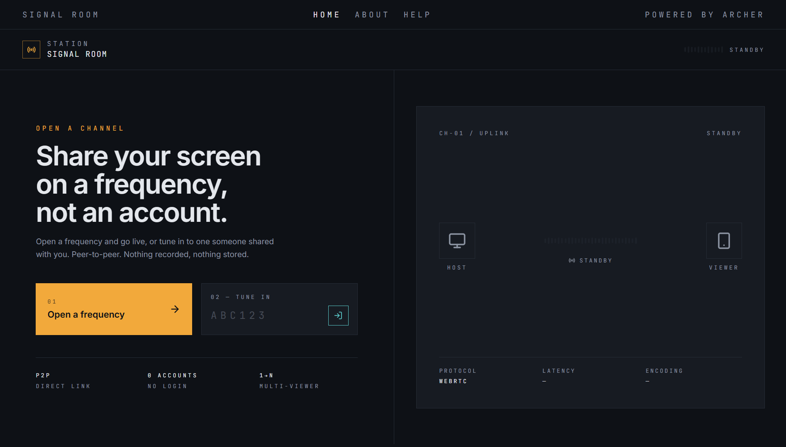

<div align="center">
  

# 📡 Viorax

**Live browser-to-browser screen sharing. No accounts. No downloads. Just connect and share.**

[](https://Viorax.vercel.app)


[](#-contributing)


🌐 **Live Demo:** https://Viorax.vercel.app
</div>

Viorax is a lightweight, frontend-only screen sharing application that lets anyone broadcast their screen instantly using a simple 6-character room code. Built on WebRTC, all streaming happens directly between peers, meaning no recordings, no stored video, and no unnecessary accounts.

## 📸 App Preview

**Desktop experience**

<div align="center">
  
  &nbsp;&nbsp;
  
  <br/>
  <sub><b>Desktop Home</b> — launch or join a session &nbsp;•&nbsp; <b>Connection Established</b> — live peer link status</sub>
</div>

<br/>

**Mobile & content screens**

<div align="center">
  
  &nbsp;&nbsp;
  
  &nbsp;&nbsp;
  
  <br/>
  <sub><b>Mobile View</b> &nbsp;•&nbsp; <b>About Section</b> &nbsp;•&nbsp; <b>Help Section</b></sub>
</div>

### 🧭 Key Screens

- **Desktop Home** — launch or join a session from the main experience
- **Connection Established** — see the live connection state once peers are linked
- **Mobile View** — responsive interface optimized for phones and tablets
- **About Section** — learn more about the project and its creator
- **Help Section** — guided usage for first-time hosts and viewers

---

## ✨ Features

- 📡 **Instant Broadcasting** — Start sharing your screen in seconds.
- 🔢 **6-Character Room Codes** — Easy-to-share frequency-style codes.
- 🔒 **Peer-to-Peer Streaming** — Direct WebRTC connections with no video stored on a server.
- 👥 **Multi-Viewer Support** — Broadcast to multiple viewers simultaneously.
- 📱 **QR Code Joining** — Scan and join instantly from a mobile device.
- 💻 **Fully Responsive** — Optimized for desktop hosts and mobile viewers.
- ⚡ **No Accounts Required** — Open a room and start immediately.

---

## 🚀 Tech Stack

- **React**
- **TypeScript**
- **TanStack Router**
- **TanStack Query**
- **Tailwind CSS**
- **Vite**
- **WebRTC**
- **Bun** (Primary runtime & package manager)

---

## 📦 Installation

### Prerequisites

- Bun (recommended)
- or Node.js with npm

### Install Dependencies

```bash
bun install

# or

npm install
```

### Start Development Server

```bash
bun dev

# or

npm run dev
```

### Build for Production

```bash
bun run build

# or

npm run build
```

---

## 📁 Project Structure

```
src/
│
├── assests/
│   ├── favicon.ico
│   ├── logo.jpg
│   ├── desktop-home.png
│   ├── connection established.png
│   ├── mobile view.png
│   ├── help section.jpg
│   └── about section.jpg
│
├── routes/
│   ├── __root.tsx
│   ├── index.tsx
│   ├── about.tsx
│   └── help.tsx
│
├── components/
│   ├── DeviceSchematic
│   ├── Waveform
│   └── QrScanner
│
├── lib/
│   └── roomCode
│
public/
└── og-image.png
```

---

## 📍 Routes

| Route    | Description                      |
| -------- | -------------------------------- |
| `/`      | Create or join a Viorax          |
| `/about` | About the project and creator    |
| `/help`  | User guide for hosts and viewers |

---

## ⚙️ How It Works

1. Create a new Viorax.
2. Receive a unique 6-character room code.
3. Share the code or QR code with others.
4. Viewers join using the code or by scanning the QR code.
5. Once connected, your screen streams directly through WebRTC with no intermediary video storage.

---

## 🔒 Privacy

Viorax is built around peer-to-peer communication.

- No user accounts
- No uploaded recordings
- No cloud video storage
- Direct WebRTC connections between participants

---

## 🤝 Contributing

Contributions, issues, and feature requests are welcome! Feel free to open a pull request or file an issue.

1. Fork the repo
2. Create your feature branch (`git checkout -b feature/amazing-thing`)
3. Commit your changes
4. Push to the branch and open a PR

---

## 🌐 Live Demo

https://Viorax.vercel.app

---

## 👨‍💻 Author

**Abdul Basit (Archer)**

Portfolio: https://abdulbasit-archer.vercel.app

---

## 📄 License

This project currently has no license.

<!-- If you plan to allow others to use, modify, or contribute to the project, consider adding an MIT License or another open-source license. -->
